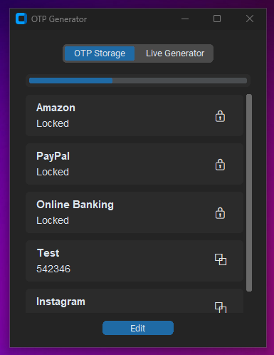
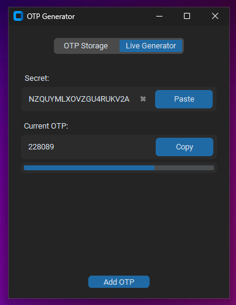
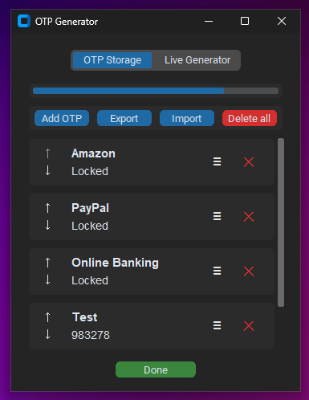

# OTP-Generator
A simple desktop OTP generator and secure OTP manager built with Python and CustomTkinter

 
 

  
  

  

 
 

## Features

- Generate TOTP codes from a secret in real time
- Live progress bar showing the current OTP interval
- Copy generated OTPs directly to the clipboard
- Save OTP entries locally in an encrypted file
- Reorder saved OTP entries in edit mode
- Import and export saved OTP entries
- Password-protect individual OTP entries
- Unlock protected OTPs only when needed
- Lock protected OTPs again manually
- Edit saved OTP names, secrets, and password settings
- Remove password protection from saved entries if needed

 
 

## Security

Saved OTP data is encrypted locally using cryptography.fernet.
For password-protected entries, the OTP secret is additionally encrypted with a key derived from the entry password using PBKDF2-HMAC-SHA256.

Important:
- Exported JSON files are not protected by the app-wide encryption layer
- If you export protected entries, their per-entry encryption remains intact
- If you export unprotected entries, their secrets are stored in plain text in the export file
- Both the local key file (key.key) and the encrypted data file (otps.enc) are currently in the same local directory (Windows: AppData/Local/OTP Generator Linux: ~/.config/OTP Generator)

